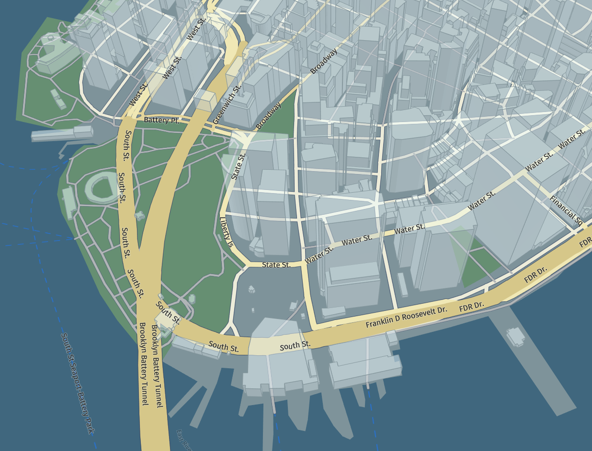

# harp.gl

`harp.gl` is an _experimental and work in progress_ open-source 3D map rendering engine.

## Overview

You can use this engine to:

  * Develop visually appealing 3D maps
  * Create highly animated and dynamic map visualization with WebGL, using the popular [THREE.js](https://threejs.org/) library.
  * Create themeable maps, with themes that can change on the fly.
  * Create a smooth map experience with highly performant map rendering and decoding. Web workers parallelize the CPU intensive tasks, for optimal responsiveness.
  * Design your maps modularly, where you can swap out modules and data providers as required.

With that in mind, we have included some modules that let's you get started with some simple web applications
that can display a map using our default style. You can get results like the one shown below:



If you want to learn more about the applications you can create, please check the [Getting Started Guide](docs/GettingStartedGuide.md).

## About This Repository

This repository is a monorepo containing the core components of `harp.gl`,
organized in a `yarn workspace`.

All components can be used stand-alone and are in the `@here` subdirectory.

## Installation

### In Node.js

All `harp.gl` modules are installable via yarn (or npm):

```sh
yarn add @here/harp-mapview
```

```sh
npm install @here/harp-mapview
```

### In Browser

Since `harp.gl` consists of a set of modules, there are no ready-made bundles available. Take a look at the examples on information on how to use tools like `webpack` to create a bundle for the browser.

## Development

### Prerequisites

* __Node.js__ - Please see [nodejs.org](https://nodejs.org/) for installation instructions
* __Yarn__ -  Please see [yarnpkg.com](https://yarnpkg.com/en/) for installation instructions.

### Download dependencies

Run:

```sh
yarn install
```

to download and install all required packages and set up the yarn workspace.

### Launch development server for harp.gl examples

Run:

```sh
yarn start
```

To launch `webpack-dev-server`. Open `http://localhost:8080/` in your favorite browser.

### Launch development server for unit tests

Run:

```sh
yarn start-tests
```

Open `http://localhost:8080/` in your favorite browser to run the tests.

### Run unit tests in Node.js environment

Run:

```sh
yarn test
```

### Run unit & integration tests in Browser environment

Run:

```sh
yarn run start-tests
>: Project is running at http://localhost:8080/
```

Note the URL and invoke tests using `mocha-webdriver-runner`. Example:

```sh
npx mocha-webdriver-runner http://localhost:8081/ --chrome
npx mocha-webdriver-runner http://localhost:8081/ --headless-firefox
```

### Generate documentation

Run:

```sh
yarn run typedoc
```

It will output all documentation under `/dist/doc`.

## License

Copyright (C) 2019 HERE Europe B.V.

See the [LICENSE](./LICENSE) file in the root of this project for license details about using `harp.gl`.

In addition, please see the following license limitations for using `harp.gl` with the [fonts resources](https://github.com/heremaps/harp-font-resources).

For other use cases not listed in the license terms, please [contact us](https://developer.here.com/contact-us).
