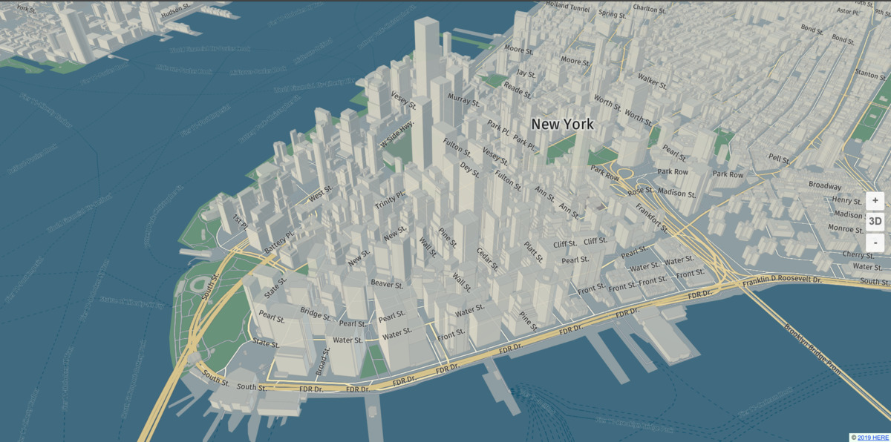

# harp.gl

[](https://github.com/heremaps/harp.gl/actions/workflows/ci.yaml?query=branch%3Amaster++) [](https://codecov.io/gh/heremaps/harp.gl) [](https://twitter.com/intent/tweet?text=harp.gl)

`harp.gl` is an _experimental and work in progress_ open-source 3D map rendering engine written in [TypeScript](https://github.com/microsoft/TypeScript).

### [harp.gl site](https://www.harp.gl/)

### [harp.gl Slack channel](https://heredev.slack.com/messages/harpgl/) Registration available [here](http://t.her.is/slack).

## Overview

You can use this engine to:

-   Develop visually appealing 3D maps
-   Create highly animated and dynamic map visualization with WebGL, using the popular [three.js](https://threejs.org/) library.
-   Create themeable maps, with themes that can change on the fly.
-   Create a smooth map experience with highly performant map rendering and decoding. Web workers parallelize the CPU intensive tasks, for optimal responsiveness.
-   Design your maps modularly, where you can swap out modules and data providers as required.

With that in mind, we have included some modules that let's you get started with some simple web applications
that can display a map using our default style. You can get results like the one shown below:



## Getting started with harp.gl

There are three methods to get up and running with harp.gl quickly, in order of difficulty:

1. Using the [yeoman generator](https://developer.here.com/tutorials/harpgl/#method-1-using-the-harp.gl-yeoman-generator-beginner).
1. linking a [simple bundle as a `<script>` tag in your html](https://developer.here.com/tutorials/harpgl/#method-2-linking-a-single-script-bundle-to-your-html-intermediate)
1. installing a [set of node modules from npm](https://github.com/heremaps/harp.gl/blob/master/docs/GettingStartedGuide.md#integrate)

If you want to learn more about the applications you can create, please check the [Getting Started Guide](docs/GettingStartedGuide.md).

## Authentication

Regardless of how you structure your project, you need some means to authenticate, please see the [following guide](https://developer.here.com/tutorials/harpgl/#acquire-credentials) to generate a token.

## About This Repository

This repository is a monorepo containing the core components of `harp.gl`,
organized in a `yarn workspace`.

All components can be used stand-alone and are in the `@here` subdirectory.

## Installation

### In Node.js

All `harp.gl` modules are installable via yarn (or npm):

```sh
yarn add @here/harp-mapview
```

```sh
npm install @here/harp-mapview
```

### In Browser

Since `harp.gl` consists of a set of modules, there are no ready-made bundles available. Take a look at the examples on information on how to use tools like `webpack` to create a bundle for the browser.

## Development

### Prerequisites

-   **Node.js** - Please see [nodejs.org](https://nodejs.org/) for installation instructions
-   **Yarn** - Please see [yarnpkg.com](https://yarnpkg.com/en/) for installation instructions.

### Download dependencies

Run:

```sh
yarn install
```

to download and install all required packages and set up the yarn workspace.

### Launch development server for harp.gl examples

Run:

```sh
yarn start
```

To launch `webpack-dev-server`. Open `http://localhost:8080/` in your favorite browser.

### Launch development server for unit tests

Run:

```sh
yarn start-tests
```

Open `http://localhost:8080/` in your favorite browser to run the tests.

### Run unit tests in Node.js environment

Run:

```sh
yarn test
```

### Run unit & integration tests in Browser environment

Run:

```sh
yarn run start-tests
>: Project is running at http://localhost:8080/
```

Note the URL and invoke tests using `mocha-webdriver-runner`. Example:

```sh
npx mocha-webdriver-runner http://localhost:8081/ --chrome
npx mocha-webdriver-runner http://localhost:8081/ --headless-firefox
```

### Run performance tests in Node.js environment

As for now, there is no baseline for performance tests results, so before examining performance one
have to establish baseline:

Performance test steps

1. Establish baseline results.

```
$ git checkout master
PROFILEHELPER_COMMAND=baseline yarn performance-test-node # create baseline of measurements for your particular platform
```

> Note, that performance test suite is very limited, so it is highly possible that you
> have to write new dedicated performance test for code that is about to be optimized.
> See `tests/performance` for examples.

2. Go back to your branch, change stuff and

3. Rerun tests with your changes

```
yarn performance-test-node --grep lines # assuming you're playing with lines
```

4. Examine output:

```
...

performance createLineGeometry segments=2
  min=0.0014ms (-2.44% vs 0.0014ms) sum=999.16ms (0% vs 999.12ms) repeats=499568.00 (-6.47% vs 534131.00) throughput=499988.43/s (-6.47% vs 534600.13/s)
  avg=0.002ms (6.92% vs 0.0019ms) med=0.0015ms (0.2% vs 0.0015ms) med95=0.0031ms (17.6% vs 0.0026ms)
  gcTime=39.6195ms (-3.39% vs 41.011ms) sumNoGc=959.54ms (0.15% vs 958.11ms) throughputNoGc=520633.00/s (-6.61% vs 557461.83/s)
```

### Generate documentation

Run:

```sh
yarn run typedoc
```

It will output all documentation under `/dist/doc`.

## License

Copyright (C) 2017-2021 HERE Europe B.V.

See the [LICENSE](./LICENSE) file in the root of this project for license details about using `harp.gl`.

In addition, please note that the [fonts](https://github.com/heremaps/harp-fontcatalog) are under a different set of licenses.

For other use cases not listed in the license terms, please [contact us](https://developer.here.com/contact-us).
