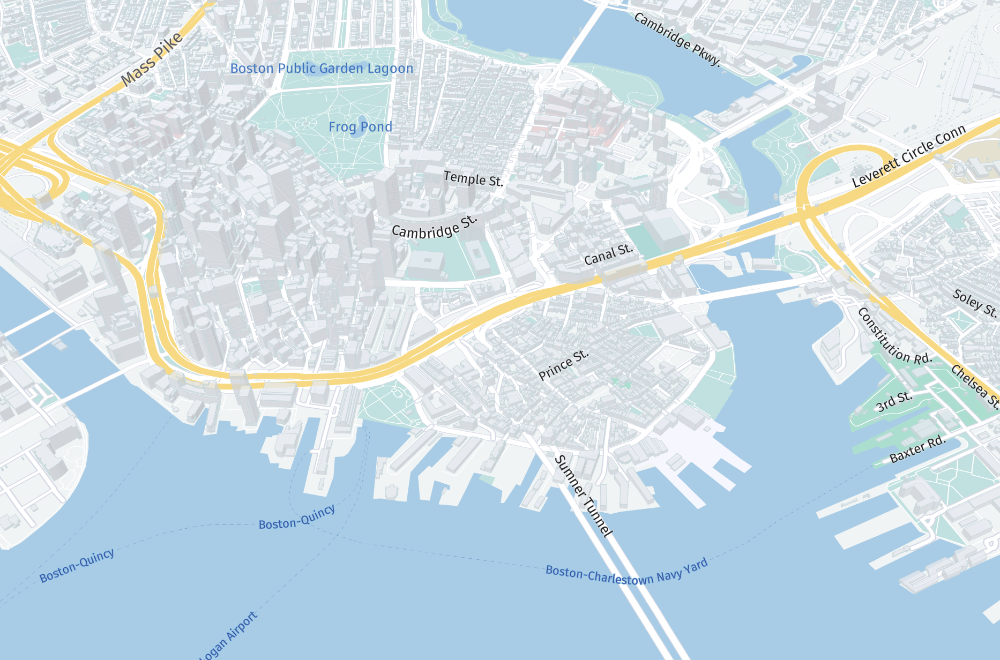

# Style Specification Guide



harp.gl uses a custom specification to style the map's layers. harp.gl currently comes with three default theme variants. Click on a theme's name to take a look at it's style specification.
* [Berlin base](../@here/harp-map-theme/resources/berlin_tilezen_base.json)
* [Berlin reduced day](../@here/harp-map-theme/resources/berlin_tilezen_day_reduced.json)
* [Berlin reduced night](../@here/harp-map-theme/resources/berlin_tilezen_night_reduced.json)

## Top-level properties

A harp.gl style specification has the following top-level properties:

```json
{
   "sky": {},
   "fog": {},
   "clearColor": "#87959A",
   "lights": [],
   "defaultTextStyle": {},
   "textStyles": [],
   "fontCatalogs": [],
   "images": {},
   "poiTables": [],
   "styles": {}
}
```

### `styles`

The `styles` object is where all the layer styling is defined (eg: water, highways, labels,earth, buildings).

```json
"styles": {
   "tilezen": [
      {
         "description": "highway-label",
         "when": "$layer == 'roads' && ((kind == 'highway') && ((kind_detail == 'motorway')))",
         "technique": "text",
         "attr": {
            "color": "#000000",
            "backgroundColor": "#FFFFFF",
            "backgroundOpacity": 0.5,
            "size": 16,
            "priority": 25,
            "fadeNear": 0.8,
            "fadeFar": 0.9
         },
         "renderOrder": 10
      }
   ]
}
```

Within `styles`, you must define a __style set name__. A style set name is a group of styles. This can be helpful if you want to apply a group of styles to an individual data source. For example, when adding a new datasource to the map, you can specify the style set name to be used:

```javascript
const omvDataSource = new harp.OmvDataSource({
   baseUrl: "https://xyz.api.here.com/tiles/herebase.02",
   apiFormat: harp.APIFormat.XYZOMV,
   styleSetName: "tilezen", // <- style set name goes here
   authenticationCode: 'YOUR-XYZ-TOKEN HERE', 
});
```

You are free to have as many style set names as you would like.

Within each style set name is where you can define style properties for layers. An individual style rule object has at least four required properties:
* __`description`__: a human-readable description of the layer
* __`when`__: a filter language for selecting the correct layer to style
* __`technique`__: the styling technique category to use. Options include `text`, `solid-line`, `dashed-line`, `fill`, and `none`.
* __`attr`__: the exact styling properties for the layer.

Some examples:


### Style a hospital

Use `fill` and assign `color` of `#89878A`.

```json
{
   "description": "hospital",
   "when": "$layer ^= 'landuse' && (($geometryType ^= 'polygon') && (kind ^= 'hospital'))",
   "technique": "fill",
   "attr": {
      "color": "#89878A"
   },
   "renderOrder": 0.1
},
```

### Style a city label with population greater than 10M

Select layer with `kind` of `locality` and population > 10M. Use `text` technique.

```json
{
   "description": "locality_pop_>10000000",
   "when": "$layer ^= 'places' && (((kind == 'locality') && has(population)) && ((population > 10000000) || has(country_capital)))",
   "technique": "text",
   "attr": {
      "priority": 61,
      "size": {
         "interpolation": "Linear",
         "zoomLevels": [1, 2, 3, 4, 5, 6, 7, 8, 9, 10],
         "values": [9.6, 11.2, 12.8, 14.4, 16, 19.2, 22.4, 25.6, 28.8, 32]
      },
      "color": "#090A0B",
      "backgroundColor": "#FFFFFF",
      "backgroundOpacity": 0.5,
      "textFadeTime": 0.75,
      "fadeNear": 0.8,
      "fadeFar": 0.9
   },
   "final": true
}
```

### Style major roads (highways)

Select layer with `kind` of `major_road`. Apply `solid-line` technique.

```json
{
   "description": "primary-fill",
   "when": "$layer == 'roads' && ((kind == 'major_road') && kind_detail in ['primary']))",
   "technique": "solid-line",
   "attr": {
      "color": "#F0E8B5",
      "lineWidth": {
         "interpolation": "Linear",
         "zoomLevels": [8, 9, 10, 11, 12, 13, 14, 16, 18],
         "values": [650, 400, 220, 120, 65, 35, 27, 9, 7]
      },
      "fadeNear": 0.8,
      "fadeFar": 0.9,
      "clipping": false
   },
   "renderOrder": 15.5,
   "final": true
}
```


## Styling your own GeoJSON layer

Say your GeoJSON looks something like:

```json
{
   "type": "FeatureCollection",
   "features": [
      {
         "id": "06398773",
         "type": "Feature",
         "properties": {
            "status": "Open",
         },
         "geometry": {
            "type": "MultiLineString",
            "coordinates": [[
               [13.999, 58.4026],
               [13.6,58.402]
            ]]
         }
      },
      {
         "id": "124773",
         "type": "Feature",
         "properties": {
            "status": "Closed",
         },
         "geometry": {
            "type": "MultiLineString",
            "coordinates": [[
               [15.893, 28.4090026],
               [13.93986,48.40302]
            ]]
         }
      }
   ]
}
```

Note that the above GeoJSON has both statuses of `Open` and `Closed` in the properties object. If I'd like to style open and closed lines differently, I could apply the following styling rules:

```json
{
   "when": "$geometryType ^= 'line' && properties.status == 'Open'",
   "renderOrder": 1000,
   "technique": "solid-line",
   "attr": {
      "color": "#50E3C2",
      "transparent": true,
      "opacity": 1,
      "metricUnit": "Pixel",
      "lineWidth": 1
   }
},
{
   "when": "$geometryType ^= 'line' && properties.status == 'Closed'",
   "renderOrder": 1000,
   "technique": "solid-line",
   "attr": {
      "color": "#D63060",
      "transparent": true,
      "opacity": 1,
      "metricUnit": "Pixel",
      "lineWidth": 1
   }
}
```

To select values in the GeoJSON's properties, you can use the syntax `properties.PROPERTY_KEY == PROPERTY_VALUE` in the `when` field.

When the status is `Open`, I apply the color `#50E3C2` to the line. When the status is `Closed`, I apply the color `#D63060`.