## Introduction

*<div style="text-align: right">Last Updated: 08/07/2019</div>*

This tutorial will introduce the basics of [harp.gl](http://harp.gl), a new and beta 3D map rendering engine for the web.

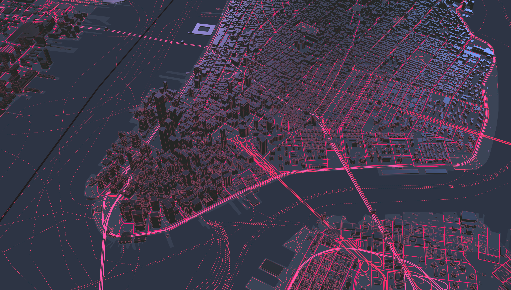

harp.gl is a beta product and we are always looking to improve it with your feedback. For any comments, suggestions, or bug reports, we encourage you to create an issue on the [harp.gl GitHub repository](https://github.com/heremaps/harp.gl/issues/new)

### Prerequisites

- Laptop with a modern web browser (Chrome, Firefox, Safari, etc.)
- Node and npm installed ([installation directions here](https://nodejs.org/en/download/))


### Resources

* [harp.gl Github repo](https://github.com/heremaps/harp.gl) (Source code for harp.gl)
* [harp.gl documentation](http://harp.gl.s3-website-us-east-1.amazonaws.com/docs/master/doc/)
* [harp.gl examples](http://harp.gl.s3-website-us-east-1.amazonaws.com/docs/master/examples/) (curated list of examples)
* [harp.gl modules on npm](https://www.npmjs.com/~heremaps)


## Key concepts {#key-concepts}

Now that you have a base setup of harp.gl, let's review some key concepts.

### MapView

A `MapView` is the high-level main object in harp.gl. This is the object you'll add new layers to or customize the style of.

### Data source

A data source is a source of data you'll add to the map. Generally, when working with maps, we'll be referring to two different types of data sources:

- __Static data source__: a single object, commonly in the geojson format. Think like a `.json` file or a javascript object.
- __Tiled data source__: a dynamic data source that is broken up into "tiles". These tiles, referenced by parameters `{x}`, `{y}` and `{z}`, are divided by different locations and zoom levels on the map. Tiled data sources are preferred for large data sets because the map only requests data for the current view of the renderer.

[HERE Studio](https://here.xyz) provides a hosting and tiling service we will be using later on in this tutorial. You'll be able to upload large datasets and Studio will provide and endpoint to access this data using the `{x}`, `{y}` and `{z}` parameters.

### GeoJSON

GeoJSON is a popular and common format for storing geo data. harp.gl accepts GeoJSON and we will be using this format throughout the tutorial.

Generally speaking, there are common types of GeoJSON objects: `Point`, `LineString`, `Polygon`.

An example of a GeoJSON `Point` is:
```json
{
   "type": "Feature",
   "geometry": {
      "type": "Point",
      "coordinates": [125.6, 10.1]
   },
   "properties": {
      "name": "Dinagat Islands"
   }
}
```
An example of a GeoJSON `LineString` is:
```json
{
   "type": "Feature",
   "geometry": {
      "type": "LineString",
      "coordinates": [
         [100.0, 0.0], [101.0, 1.0]
      ]
   },
   "properties": {
      "name": "The name of a line"
   }
}
```
An example of GeoJSON `Polygon` is:
```json
{
   "type": "Feature",
   "geometry": {
      "type": "Polygon",
      "coordinates": [
         [ [100.0, 0.0], [101.0, 0.0], [101.0, 1.0], [100.0, 1.0], [100.0, 0.0] ]
      ]
   },
   "properties": {
      "name": "a polygon for harp.gl!"
   }
}
```

Resources:
- [GeoJSON specification](https://geojson.org/) and [GeoJSON blog post](https://macwright.org/2015/03/23/geojson-second-bite.html) by Tom MacWright
- [GeoJSON Viewer tool](http://geojson.tools/)

_Note: GeoJSON uses the format [Longitude, Latitude] for the coordinate system, while harp.gl uses [Latitude, Longitude]. Be careful not to get these confused!_

### harp.gl style sheets and syntax

harp.gl has its own syntax for styling the map. The styling syntax lives inside a `json` file and contains rules for how the visuals are drawn. For example, in the style sheet, you can specify things like.

- the width for roads
- the background color for water
- the mulitplier of the height of 3d buildings

You can take a look at a sample style sheet here: [https://unpkg.com/@here/harp-map-theme@latest/resources/berlin_tilezen_night_reduced.json](https://unpkg.com/@here/harp-map-theme@latest/resources/berlin_tilezen_night_reduced.json)

Let's take a look at some example styles. These will be helpful later on when styling data overlayed on a map.

__Style a point__

This technique will style all geometry types that are points with `#7ED321` color and `15` size. Example [here][1].
```json
{
  "when": ["==", ["geometry-type"], "Point"],
  "technique": "circles",
  "renderOrder": 10000,
  "color": "#7ED321",
  "size": 15
}
```

__Style a line__

This technique will style all geometry types that are lines with `blue` color and `1px` width. Example [here][2].

`renderOrder` is the z-index value for the render order. A large number means that the object will show up first.
```json
{
  "when": ["==", ["geometry-type"], "LineString"],
  "renderOrder": 1000,
  "technique": "solid-line",
  "color": "#3333FF",
  "opacity": 1,
  "metricUnit": "Pixel",
  "lineWidth": 1
}
```

__Style a polygon__

This technique will style all geometry types that are lines with `#525556` color and `0.8` opacity. Example [here][3].
```json
{
  "when": ["==", ["geometry-type"], "Polygon"],
  "technique": "fill",
  "opacity": 0.5,
  "color": "#525556",
  "renderOrder": 0
}
```

### Projections

Technically, [all maps have been lying to you](https://www.iflscience.com/environment/how-maps-can-lead-you-wrong-idea/). That's because it's difficult to project the spherical earth onto a perfect rectangle.

_Side note: for some fun with mercator projections, check out [The True Size of](https://thetruesize.com/), a cool web app to explore the different sizes of countries depending on where they are._

harp.gl provides two different views:

- mercator: the classic and one of the most popular flat projections, demo available [here](https://www.harp.gl/docs/master/examples/#getting-started_hello-world_npm.html).
- globe: an accurate representation of earth as a sphere, as seen from space, demo available [here](https://www.harp.gl/docs/master/examples/#rendering_globe-atmosphere.html).

Mercator

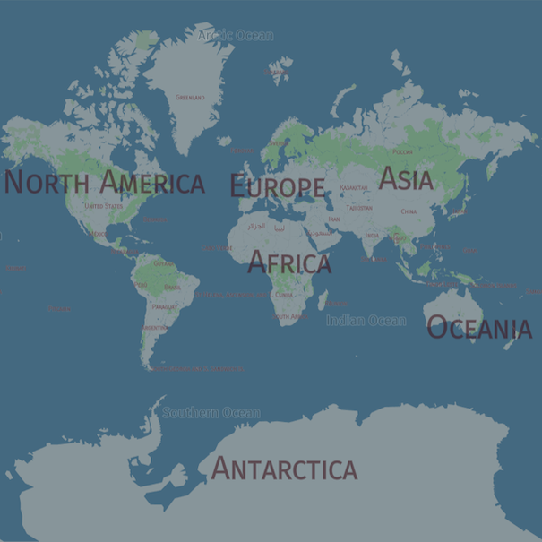

Globe

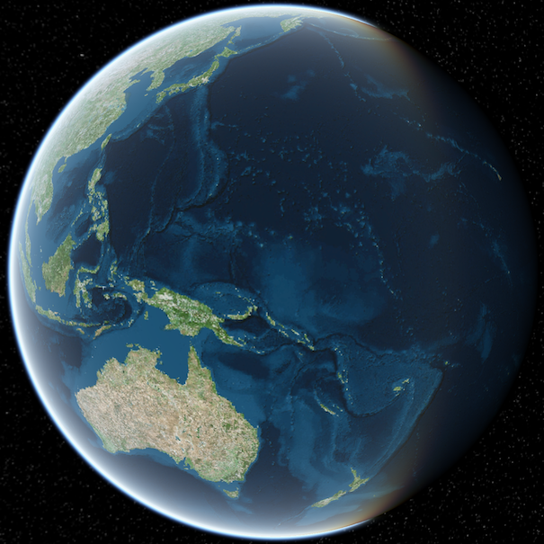|

Now onto the fun part... making some maps! 🌍

## Acquire credentials {#acquire-credentials}

harp.gl is an open-source and free software project. However, harp.gl needs to be connected to a data source in order to display a map.

HERE Studio, another HERE product, is a service for storing and managing geospatial data. HERE XYZ will provide the vector tile data endpoint and authentication for harp.gl.

### Become a HERE Developer

Navigate to [developer.here.com](https://developer.here.com/) and click __Get started for free__.

[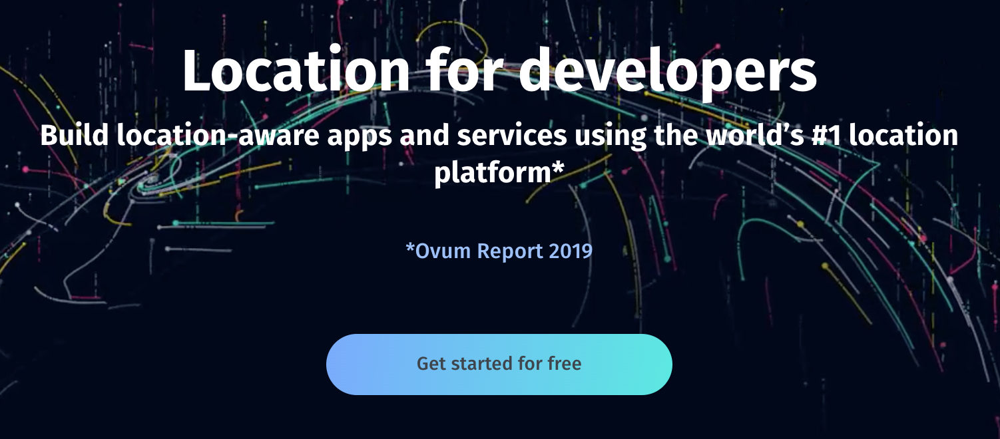](https://developer.here.com/sign-up)

Create an account. __No credit card is required__.

After you sign up, you will me taken to a page which says "Project Details" on the left and "Get your credentials:" in the middle.

Under the REST section, click "Generate App", then click "Create API key". The result should look like:

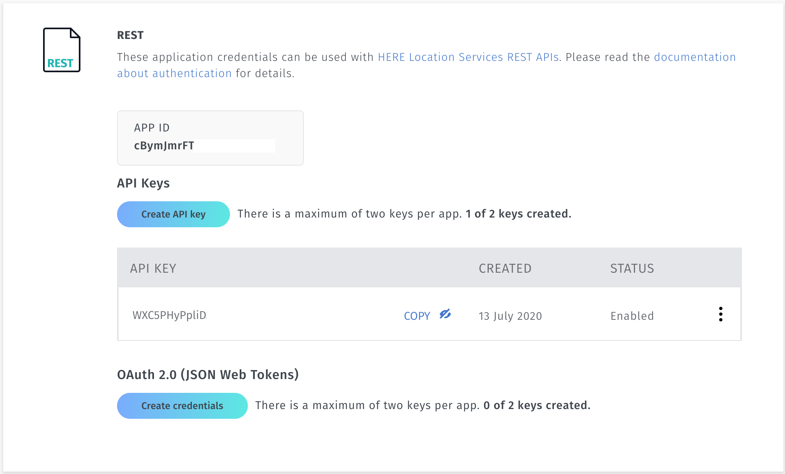

Copy the key you are given.

You can test it works by appending the app id to the following URL: https://vector.hereapi.com/v2/vectortiles/base/mc/15/9646/12321/omv?apikey=

## Install harp.gl {#install}

You can get started with harp.gl on the web with three different methods, ordered by ease of use.
1. using the yeoman generator
1. linking a single bundle as a `<script>` tag in your html page
1. installing harp.gl as a set of [TypeScript](https://www.typescriptlang.org/) modules through npm

In this tutorial, you are free to choose whatever method you please, but for simplicity, __we recommend using the harp.gl yeoma generator (method #1)__, because it gets you coding the the fastest. This tutorial's code will be based on this method.

### Method 1: Using the harp.gl yeoman generator (beginner)

Setting up harp.gl is very simple with the yeoman generator:

- `mkdir harp.gl-example && cd harp.gl-example`
- `npx -p yo -p @here/generator-harp.gl yo @here/harp.gl`, It will ask you to enter
   - package name
   - TypeScript or JavaScript
   - API key you generated above
- `npm start`
- open `http://localhost:8080/` in a browser of your choice

All going well, you should see a map with buildings in New York.

Further information including pre-requisites are here: https://github.com/heremaps/harp.gl/blob/master/%40here/generator-harp.gl/README.md

### Method 2: Linking a single `script` bundle to your html (intermediate)

In your command line, create a new directory and navigate into it:

```bash
mkdir harp.gl-tutorial
cd harp.gl-tutorial
```

Create two files: `index.html` and `index.js`:

```bash
touch index.js
touch index.html
```

Copy and paste the following code into each of the files.

__`index.html`__

```html
<html>
   <head>
      <style>
         body, html { border: 0; margin: 0; padding: 0}
         #map { height: 100vh; width: 100vw; }
      </style>
      <script src="https://unpkg.com/three/build/three.min.js"></script>
      <script src="https://unpkg.com/@here/harp.gl/dist/harp.js"></script>
   </head>
   <body>
      <canvas id="map"></canvas>
      <script src="index.js"></script>
   </body>
</html>
```

__`index.js`__
```javascript
const canvas = document.getElementById('map');
const map = new harp.MapView({
   canvas,
   theme: "https://unpkg.com/@here/harp-map-theme@latest/resources/berlin_tilezen_night_reduced.json"
});

// center the camera to New York
mapView.lookAt({
  target: new GeoCoordinates(40.70398928, -74.01319808),
  zoomLevel: 17,
  tilt: 40,
});

const mapControls = new harp.MapControls(map);
const ui = new harp.MapControlsUI(mapControls);
canvas.parentElement.appendChild(ui.domElement);

map.resize(window.innerWidth, window.innerHeight);
window.onresize = () => map.resize(window.innerWidth, window.innerHeight);

const omvDataSource = new harp.OmvDataSource({
   authenticationCode: 'YOUR-TOKEN HERE',
});
map.addDataSource(omvDataSource);
```

__NOTE:__ be sure to swap out `YOUR-TOKEN-HERE` for the token you obtained above.

You can just run it with a simple server, for example, to run a local server, use:
```bash
python -m SimpleHTTPServer 8888
```
and in Python 3.x

```bash
python -m http.server 8888
```

Or try: https://www.npmjs.com/package/live-server

Further information is available here: https://www.npmjs.com/package/@here/harp.gl

Note also, for those who want to have typings, they are available here: https://unpkg.com/browse/@here/harp.gl@0.17.0/dist/harp.d.ts and just need to be referenced in the `tsconfig.json`

### Method 3: Install harp.gl modules through npm (advanced)

We have packages available on npm that can be ingested and used immediately, the most commonly used package is: https://www.npmjs.com/package/@here/harp-mapview, this is best used if you already have some way to bundle the code like https://webpack.js.org/

More information can be found here: https://github.com/heremaps/harp.gl/blob/master/docs/GettingStartedGuide.md

## Further examples

There are many examples https://www.harp.gl/docs/master/examples/ available which show different features and use cases.

## Modify the map {#modify-the-map}

At this point, you should have a map up and running.

### Change the map's center and zoom

You can center the map at whatever point you would like in the world with this method:

```javascript
// center the camera to New York at zoom level 16
mapView.lookAt({
  target: new GeoCoordinates(40.70398928, -74.01319808),
  zoomLevel: 16,
});
```

Try changing the map to where you come from! To find the coordinates of your city: [latlong.net](https://www.latlong.net)

### Change the map's pitch and rotation

Since harp.gl is a 3D engine, you can change the pitch and bearing to view the map at a different perspective.

To change the pitch and bearing with a user event:
- on a mac trackpad: two finger hold and drag
- on a mouse: right click hold and drag

To programmatically change the map's perspective you can reuse the [lookAt] method you are already familiar with (units in degrees):

```javascript
mapView.lookAt({
  tilt: 60,
  heading: 90,
});
```

Note, assuming the `target` and `zoomLevel` were already set, subsequent calls to this method only need the `tilt` and  `heading`, because the other properties are kept the same.

### Change the map's projection to globe

You can specify the projection type in the [MapView's constructor.](https://www.harp.gl/docs/master/doc/classes/harp_mapview.mapview-1.html#constructor)

To implement a globe projection, you will need to go to `View.ts` and change:

```javascript
import { sphereProjection } from "@here/harp-geoutils";
...
const mapView = new MapView({
   ... other properties
   projection: sphereProjection
});
```

In `index.ts`:
```javascript
//And set it to a view where you can see the whole world:
mapView.lookAt({
  zoomLevel: 4,
});
```

### Change the map's theme {#change-the-maps-theme}

harp.gl comes with three theme variants called _Berlin_. These _Berlin_ themes were inspired by the vibrant city of [Berlin](https://en.wikipedia.org/wiki/Berlin), where most of the development for harp.gl is done.

- Berlin base: [resources/berlin_tilezen_base.json](https://github.com/heremaps/harp.gl/blob/master/%40here/harp-map-theme/resources/berlin_tilezen_base.json)
- Berlin reduced day: [resources/berlin_tilezen_day_reduced.json](https://github.com/heremaps/harp.gl/blob/master/%40here/harp-map-theme/resources/berlin_tilezen_day_reduced.json)
- Berlin reduced night: [resources/berlin_tilezen_night_reduced.json](https://github.com/heremaps/harp.gl/blob/master/%40here/harp-map-theme/resources/berlin_tilezen_night_reduced.json)

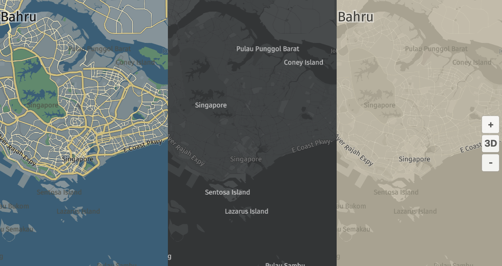

You can set a theme in `MapView`'s constructor:

```javascript
const map = new MapView({
   /*...*/
   theme: "resources/berlin_tilezen_night_reduced.json"
});
```

This works because webpack copies the themes into a `resources` directory. Alternatively, you can use a url to link to the theme:

```javascript
const map = new MapView({
   /*...*/
   theme: "https://unpkg.com/@here/harp-map-theme@latest/resources/berlin_tilezen_night_reduced.json"
});
```

You can also extend a theme, if you are happy with the base theme but just want to tweak it a bit, see the [real time shadow example](https://www.harp.gl/docs/master/examples/codebrowser.html?src=src%2Freal-time-shadows.ts) and search for `extends`.

If you'd like to modify the stylesheet directly (which, we'll be doing in the next section), you can simply download the stylesheet and save it in your local directory. For example, if you have a theme `dark.json` in the `resources` directory, you can reference it as:

```javascript
const map = new MapView({
   /*...*/
   theme: "resources/dark.json"
});
```

### Add a rotating camera
With harp.gl, you can add a rotating camera for a slick visual effect.

```javascript
mapView.lookAt({
  target: new GeoCoordinates(1.278676, 103.850216),
  tilt: 45,
  zoomLevel: 16,
});
let heading = 0;
mapView.addEventListener(MapViewEventNames.Render, () => {
  mapView.lookAt({ heading });
  heading += 0.1;
});
mapView.beginAnimation();
```

## Style the base map {#style-the-base-map}

Since harp.gl is a vector-based renderer, you can style the map on the client side to look however you like. You can style any map layer as you like to match your organization's brand guidelines, or just to have fun with your favorite colors.

harp.gl has a companion interactive map styling tool that helps with the map design prototyping process. You can access it here:

[heremaps.github.io/harp-map-editor](https://heremaps.github.io/harp-map-editor)

Play around with the editor to change the style properties of some of the layers.

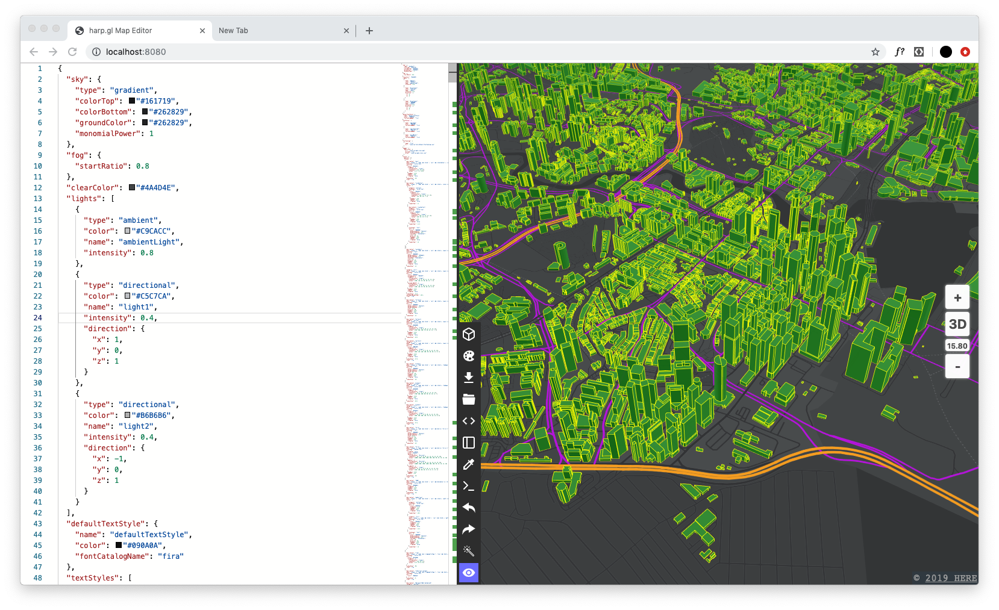

When you are happy with the map style you've created, you can download the style by pressing the download icon in the center vertical toolbar.

Move the file to your project's `resources` directory, and update the style source file in the constructor:

```javascript
const app = new View({
  canvas: ...
  theme: "resources/my-beautiful-new-style-made-with-harp-map-editor.json",
});
```

## Add data to the map {#add-data}

At this point, you should have experimented with a few cool tricks with controlling the map and maybe even added a custom style. In this section we'll learn how to add data to the map.

As mentioned in the _Key Concepts_ section of this tutorial, there are two different types of datasources to add to harp.gl: static and tiled. Static data sources are non-tiled data sources that can be added to the map at once. Tiled data sources come from endpoints that return data only required based on the map's current viewport.

### Add static GeoJSON to the map

Download the file called `wireless-hotspots.geojson` [[LINK](./resources/wireless-hotspots.geojson)]. This dataset is a list of all the wireless hotspot locations throughout Singapore. The dataset is from the [Singapore Public Data Website](https://data.gov.sg/dataset/wireless-hotspots?resource_id=98971e0f-6fcd-408b-b01e-c5d75a35c796).

Download this file and save it into your project's `resources` directory.

Let's add it to our map using this code (add to the end of `index.ts`):

```javascript
// Near the top of the file:
import { VectorTileDataSource, GeoJsonDataProvider } from "@here/harp-vectortile-datasource";

....

// At the bottom of the file:
async function getWirelessHotspots() {
  const res = await fetch("resources/wireless-hotspots.geojson");
  const data = await res.json();
  const dataProvider = new GeoJsonDataProvider("wireless-hotspots", data);
  const geoJsonDataSource = new VectorTileDataSource({
    dataProvider,
    name: "wireless-hotspots",
  });
}

getWirelessHotspots();
```

In the above code block, what we've done so far is:
- fetch the data `wireless-hotspots.geojson` from our local directory with the `fetch` method and `await`
- create a new `GeoJsonDataProvider` with the following parameters: name of data source (`String`) and the GeoJSON data object (`Object`). The `GeoJsonDataProvider` helps parse and tile the data.
- create a new data source from the provider with `VectorTileDataSource`, the default data source type for harp.gl. We configure it using the following parameters.
   - `dataProvider`: the data provider object we created in the previous line
   - `name`: the name of the data source for reference
   - `styleSetName`: the style group that will be applied to the object. Only if you are referencing a style group from the main map theme. In this example, this is not necessary.

The next steps we need to do before seeing the data on the map are:
   - adding the data source to the map
   - styling the data source
   - setting the camera in the correct location

Add the following code snippet to the `getWirelessHotspots` function.

```javascript
async function getWirelessHotspots() {
   /* Code as above ...*/
   await mapView.addDataSource(geoJsonDataSource);
   const styles: StyleSet = [
      {
      when: "$geometryType == 'point'",
      technique: "circles",
      renderOrder: 10000,
      color: "#FF0000",
      size: 15,
      },
   ];
   geoJsonDataSource.setStyleSet(styles);
   mapView.lookAt({
      target: new GeoCoordinates(1.278676, 103.850216),
      tilt: 45,
      zoomLevel: 16,
   });
   mapView.update();
}
```

With the above code, we've binded the styling rules to the datasource. Refresh your browser and take a look at the map, you should see something similar to:

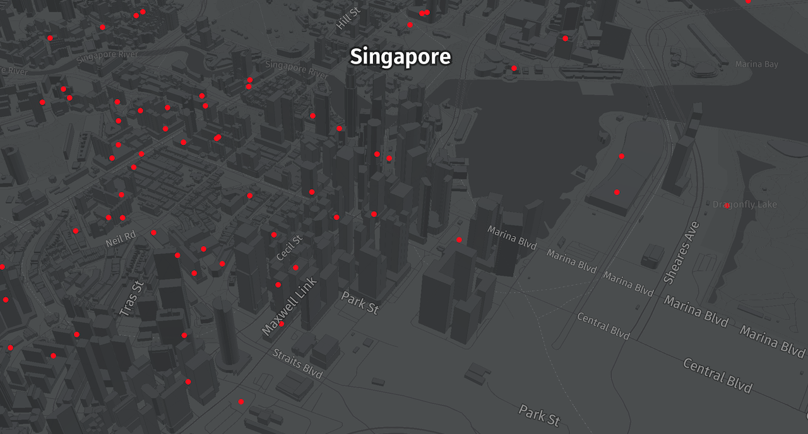

Feel free to add some GeoJSON of your own to the map and style it!

What to make a map of? Here are some places you can access geojson data to get some inspiration!
- [USA open data](https://www.data.gov/)
- [Singapore open data](https://data.gov.sg/)
- [World Bank open data](https://data.worldbank.org/)
- [Germany open data](https://www.govdata.de/)

### Add tiled GeoJSON from a server

In this next step, we'll try adding a different type of data source to the map: tiled geojson from a server.

For simplicity, we'll be using a sample data source already uploaded to an XYZ Space. However, if you'd like to learn how to upload your own data to an XYZ Space in order to add tiled data to a map, please follow this tutorial: [Using the Data Hub CLI](https://developer.here.com/tutorials/using-the-xyz-cli/).

The data set we'll be adding will be global railroads. The data comes from the [Global Humanitarian Data Exchange](https://data.humdata.org/dataset/global-railways).

To add tiled data from an XYZ Space, we'll be using the `VectorTileDataSource` class again. `VectorTileDataSource` can accept a few different types of data sources. For more information, please take a look at: [`OmvRestClient.ts`](https://github.com/heremaps/harp.gl/blob/master/@here/harp-vectortile-datasource/lib/OmvRestClient.ts).

Create a new object from `VectorTileDataSource` called `globalRailroads`.

```javascript
const globalRailroads = new VectorTileDataSource({
   baseUrl: "https://xyz.api.here.com/hub/spaces/hUJ4ZHJR/tile/web",
   apiFormat: APIFormat.XYZSpace,
   authenticationCode: 'ACbs-cqcFI4FlPRLK_VF1co', //Use this token!
});
```

__NOTE:__ in earlier examples, we were using your own Studio token within `authenticationCode`. However, in this example, we are accessing a shared dataset, so please use the access token in the example above.

The above code will create and connect to the new data source, but we still need to display it on the map:

```javascript
// At the top of index.ts
import {
  VectorTileDataSource,
  APIFormat,
} from "@here/harp-vectortile-datasource";

// At the bottom of index.ts
async function addRailRoads() {
   const globalRailroads = new VectorTileDataSource({
      baseUrl: "https://xyz.api.here.com/hub/spaces/hUJ4ZHJR/tile/web",
      apiFormat: APIFormat.XYZSpace,
      authenticationCode: 'ACbs-cqcFI4FlPRLK_VF1co', //Use this token!
   });

   await mapView.addDataSource(globalRailroads);
   const styles = [
      {
      when: ["==", ["geometry-type"], "LineString"],
      renderOrder: 1000,
      technique: "solid-line",
      color: "#D73060",
      opacity: 1,
      metricUnit: "Pixel",
      lineWidth: 1,
      },
   ];
   globalRailroads.setStyleSet(styles);
   mapView.update();
}
addRailRoads();
```

To add the datasource, we'll use the command `await map.addDataSource(source)` (just like what we did before). Note, to use `await`, you need to wrap it in an `async function`.

This is where we assign the styling rules (see the section _Key Concepts_ for more information about styling rules). Since our dataset consists only of lines, we will use the geometry type `line`.

Finally, we set the style using `.setStyleSet(styles)` and update the map with `map.update()`.

Your map should look something like:


## Data driven styling {#data-driven-styling}

The globals railroads map looks great, but every line is the same color. It might be a little more interesting to color the features by a certain property.

Let's take a look at what a sample feature looks like in the dataset:

```json
{
   "id": "06398773f63ab719ded60ab040c997b3",
   "type": "Feature",
   "properties": {
      "iso3": "SWE",
      "source": "American Digital Cartography 2004",
      "status": "Open",
      "country": "Sweden",
      "remarks": null,
      "createdate": "2008-01-07T23:00:00Z",
      "updatedate": "2008-01-07T23:00:00Z",
      "lastcheckdate": null,
      "gdb_geomattr_data": null
   },
   "geometry_name": "shape",
   "geometry": {
      "type": "MultiLineString",
      "coordinates": [[
         [13.886099999999999, 58.409133868000026],
         [13.870299999999986,58.40373386800002]
      ]]
   }
}
```
We can make this map a little bit interesting by styling railways that are open and closed. Instead of every line being the same color, we can style open railways one color and closed a different color.

This is called _data driven styling_. Styling features based on certain attributes in the dataset.

Let's slightly modify the `styles` block from before:

```javascript
const styles = [
   {
      when: [
        "all",
        ["==", ["geometry-type"], "LineString"],
        ["==", ["get", "status"], "Open"],
      ],
      renderOrder: 1000,
      technique: "solid-line",
      color: "#50E3C2",
      opacity: 1,
      metricUnit: "Pixel",
      lineWidth: 1,
   },
   {
      when: [
        "all",
        ["==", ["geometry-type"], "LineString"],
        ["match", ["get", "status"], ["Closed", "unknown"], true, false],
      ],
      renderOrder: 1000,
      technique: "solid-line",
      color: "#D63060",
      opacity: 1,
      metricUnit: "Pixel",
      lineWidth: 1,
   },
];
```

Which produces:
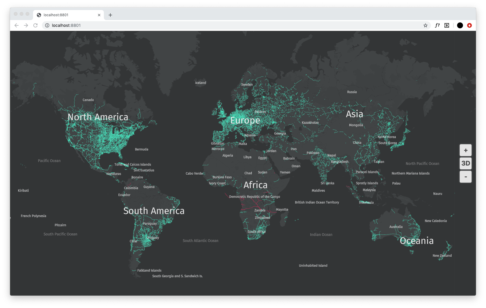

Let's take a look at the styling rules:
```json
when: [
   "all",
   ["==", ["geometry-type"], "LineString"],
   ["==", ["get", "status"], "Open"],
],
```
What's going on here? We are searching for `all` conditions which are true:
- the geometry type is a `LineString`
- the value of `status` (one of the `properties` in the data) is `Open`

When a feature matches that certain criteria, we apply the styling rules. As you can see from the code block, we've created two styling rules, a rule for when status is open, or closed and unknown

This should give us a map with two different colors, depending on the feature's status. There aren't too many closed rails, but they are the ones highlighted in red.

If you are interested in learning more about how to style the map, see the [README](https://github.com/heremaps/harp.gl/blob/master/@here/harp-datasource-protocol/README.md#how-to-style-a-map---overview-of-harpgls-map-styling). The possible expressions are documented in the guide to [Style Expressions](https://github.com/heremaps/harp.gl/blob/master/@here/harp-datasource-protocol/StyleExpressions.md).

Alternatively, if you prefer to learn by a real example, try playing around with the [harp-map-editor](https://heremaps.github.io/harp-map-editor/).

## Add 3D objects to the map {#threed-objects}

Since harp.gl is built upon [three.js](https://threejs.org/), you can add any 3D to the map scene, just like you would with any other three.js scene.

For more information on three.js scenes and objects, please take a look at the [three.js manual](https://threejs.org/docs/#manual/en/introduction/Creating-a-scene).

### Add a simple cube

Let's take a look at how to add a basic 3d object: a cube. When the user clicks on the map, we'll add a cube to the clicked location on the map.

First we register the click event.

```javascript
window.addEventListener("onclick", (evt) => {
   //TODO: Create the three.js cube
   //TODO: Get the position of the click
   //TODO: Add object to the map
});
```

Then, we'll create the 3D cube:

```javascript
const geometry = new THREE.BoxGeometry(100, 100, 100);
const material = new THREE.MeshStandardMaterial({ color: 0x00ff00fe });
const cube = new THREE.Mesh(geometry, material);
cube.renderOrder = 100000;
```

Next, we'll get the coordinates of the click event and assign it to the cube.

```javascript
const geoPosition = map.getGeoCoordinatesAt(evt.pageX, evt.pageY);
cube.geoPosition = geoPosition;
```

Then we add it to the map.
```javascript
map.mapAnchors.add(cube);
map.update();
```

It should look like this:

```javascript
window.addEventListener("click", (evt) => {
  //Create the three.js cube
  const geometry = new THREE.BoxGeometry(100, 100, 100);
  const material = new THREE.MeshStandardMaterial({ color: 0x00ff00fe });
  const cube = new THREE.Mesh(geometry, material);
  cube.renderOrder = 100000;

  //Get the position of the click
  const geoPosition = mapView.getGeoCoordinatesAt(evt.pageX, evt.pageY);
  cube.anchor = geoPosition;

  //Add object to the map
  mapView.mapAnchors.add(cube);
  mapView.update();
});
```

After clicking on the map a few times, you should have a result that looks like:

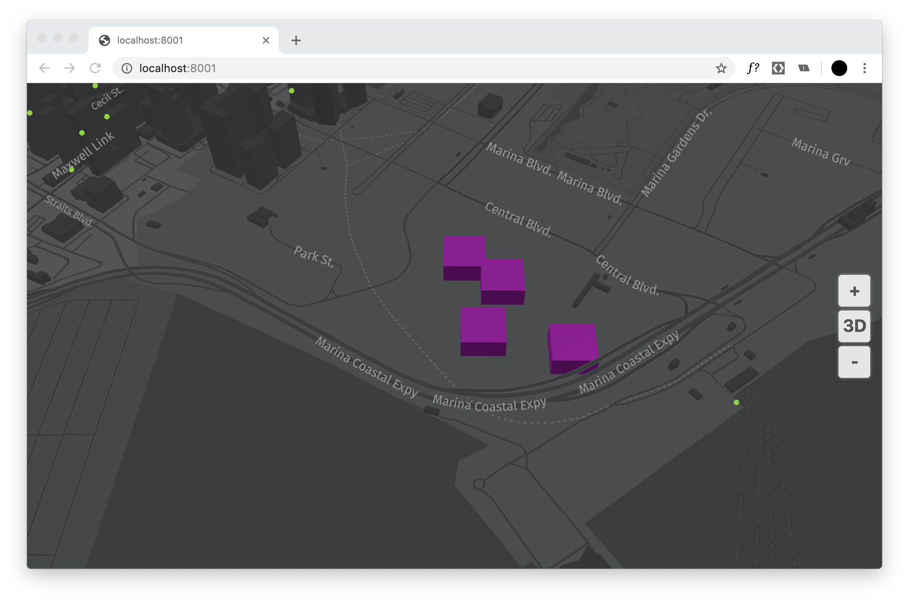

### Add an animating 3D object

Let's be honest, the simple cube on the map wasn't anything special. How about an animating 3D person?

First, we'll need to add some additional three.js imports to the html. We'll be adding inflate.min.js and FBXLoader.js, which will help with loading the 3D object.

__`index.html`__
```html
<head>
   <!-- these scripts go below three.js and harp.js imports -->
   <script src="https://threejs.org/examples/js/libs/inflate.min.js"></script>
   <script src="https://threejs.org/examples/js/loaders/FBXLoader.js"></script>
</head>
```

We've included a file called [`dancing.fbx`](resources/dancing.fbx). Make sure to download this into your directory so we can properly load it.

```javascript
onst clock = new THREE.Clock();
let mixer;

//Initialize the loader
const loader = new THREE.FBXLoader();
window.addEventListener("click", (evt) => {
  loader.load("resources/dancing.fbx", (obj) => {
    mixer = new THREE.AnimationMixer(obj);

    const action = mixer.clipAction(obj.animations[0]);
    action.play();

    obj.traverse((child) => (child.renderOrder = 10000));
    obj.renderOrder = 10000;
    obj.rotateX(Math.PI / 2);
    obj.scale.set(2.3, 2.3, 2.3);
    obj.name = "human";

    //Assign the coordinates to the obj
    const geoPosition = mapView.getGeoCoordinatesAt(evt.pageX, evt.pageY);
    obj.anchor = geoPosition;
    mapView.mapAnchors.add(obj);
  });
});
```

Finally, we'll fire up the animation:

```javascript
import { MapViewEventNames } from "@here/harp-mapview";
...
mapView.addEventListener(MapViewEventNames.Render, () => {
  if (mixer) {
    const delta = clock.getDelta();
    mixer.update(delta);
  }
});
mapView.beginAnimation();
```

And you should see something like this:

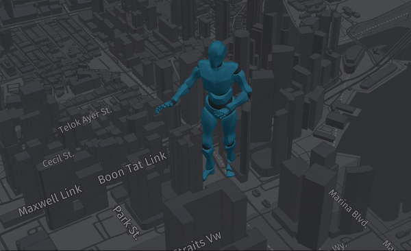

If you click multiple times there will be other dancers loaded. Try to fix it so that all dance at the same time.

## Review {#review}

Congratulations, you've finished the tutorial for harp.gl! So far, you've learned how to:
- create a new harp.gl application from scratch
- customize the map's theme
- add data to the map
- add data-driven styling rules to the map
- add 3D objects to the map

If you spot any mistakes or need clarification, you can reach us at:
- [Twitter](https://twitter.com/intent/tweet?text=harp.gl).
- [Github Issues](https://github.com/heremaps/harp.gl/issues).
- [Register for our slack channel](http://t.her.is/slack) and write to us [here](https://heredev.slack.com/messages/harpgl/).

[1]: https://heremaps.github.io/harp-map-editor/?settings=UEsDBAoAAAAIAJA06VCdctyN3AEAAHEFAAANAAAAc2V0dGluZ3MuanNvbo1UTY/aMBD9K5XbY4ryQQgg7WFFOayqqitR7aXh4HUGsNbYW2dSCij/vWPCR4IS2Dkg5s2bD96z2DPIJBr7i7/OZAZszBQskHl1eEfwwPdr2IvM5asiGG0BJ/xJL8yzFG9NdFJYCxpnuHV8hlLBDvR5wQ/+/iJhM0OOrrxPWSZz5FpAysbhIBj24v5oGEVJPOwPktBLGXK7BKQqcRVHiUXmuHHYi8MwikJi+VFyoCqjl6d6EPUITcJolAyjfuQPqM7Vud0vXb6T6wJXLnWLpMLj179gc2m0G1PS6VwIyPPvsH3K6OY6MANhAStQG5QLKehEo/MrxRq1SuEkDD2G8A+nB2HGwqhirUmEpAErqYkcDBpgbgorYGKySkP9iSJlQgG3E6OMpcMp/zxMRvHoMWXeiZE7V3JXPTZV8NEkh/++4C72zbSib1at3Avh4eG88zo6eqq+JZg1oN1+xe07mdROnXtda5+N1NjW1tZCvxrESss/BVRqCWnFQZxWMr3pDOxPSx+OHvgUrURR0z+ZfovCoGNiTq+gGtWslt4HLLi6fSGV6lhz1yze0XrXrRsu3+k9uY03B1SsL4pvnebdvLl368oN/dF0ts8/+lbqrk4PcT2yvKTHqYSUrPwPUEsBAhQACgAAAAgAkDTpUJ1y3I3cAQAAcQUAAA0AAAAAAAAAAAAAAAAAAAAAAHNldHRpbmdzLmpzb25QSwUGAAAAAAEAAQA7AAAABwIAAAAA
[2]: https://heremaps.github.io/harp-map-editor/?settings=UEsDBAoAAAAIAG5c6VBTvPoJBgIAAMwFAAANAAAAc2V0dGluZ3MuanNvbo1UTW/bMAz9K4W2oxv4Y46dAD0MQQsU27AC2brDnIMqMwkxRcpkeqlT+L9PivMNOykPQfj4HkmRhN8Y5Eja/OAvY8yBDZmEKTHvGF5buO/7R9gzFvgiLUymhB3+qKb6CcUfNpxyWezhUWkMKBpT5QSMUMIa1L7CN758RliNiZMLv2Usx4K4EpCxYegHftqL+mE/ioIkTMLYyxhxMwOyUcuVnJDK3HHjsBcHSeL34zDxo9QxpVazXTiIelEUDvxBGKdJ6n9KHIHLvdyvnb/GRUlz57pCKGn79x+YArVyeWrbOhcCiuILVI+57fkYGIMwQA2oNOEUhW1Rq2I/su1wToLNjJMw9BjBK91vJjMUWpYLxYaRfwJLVJYcpCdgoUsjYKTzZojqxlrGhARuRlpqYzu3/oc0GcSDzxnzdozCraVw0a2ogbdbcvjvA+7s7dRt6Kt5K/dAuLvb1zy3Dk2jm4FeAJnqlqql3VI7deJ1lf1qRzUmg2rWpm3TZcweaw7mu7E/7kmBb62VSCDmCv+W0My20BLzW7ec1qfaZRztIbL28NBB1EsukKpN9VaCGwmKnwqpSfeEryA7krmGfmG+Oeqb4JRRe+/Y7dkzpyi7Sl29At4hvXoGF87ninZ3RnQxQcP6KHnllt7Nm3iXulzZT1infPLe+zs+k/uNnaesD+42q0VqVv8HUEsBAhQACgAAAAgAblzpUFO8+gkGAgAAzAUAAA0AAAAAAAAAAAAAAAAAAAAAAHNldHRpbmdzLmpzb25QSwUGAAAAAAEAAQA7AAAAMQIAAAAA
[3]: https://heremaps.github.io/harp-map-editor/?settings=UEsDBAoAAAAIAK5c6VB+vhSd4wEAAFwFAAANAAAAc2V0dGluZ3MuanNvbo1UyW7bMBD9lYLtUTEoKtRiIIfCyCEoCgRwkUuVA0ONbSI06VKjprLhfy8ZyVvijSfNm/dme4ZXBCqF1v0SL2NVARkSDRMk0T689HBK6R72pGr1oj2MroEN/mAm9lHJVzKcCF1v4VHjHBgcYxsEBJWGJZhth59i8aTgbYwCQ3pVkkrVKIyEkgw5ZdmAFjTlOSuSOI+jkqBwU0Cf9FQtUGFTvVPZgDNGc85ZmvAi8UxtzXSTjpNBkmUZiwsaF/ltnGaeIPRWTtchXqp5gzMf3tBBXITH0iK7pTTmeajohw+dqf/8C65W1oTSa7+MkBLq+ge0D5XfYh8Yg3SAHWgsqomSfmpr6u0R+3MdJLurZ4xFBOEf3r/faiitbuaGDJP4ANbKeHJCD8DaNk7CyFbdWc0X/0oiNQg3sto6P7mPv+ZZwYvvJYk2jDoYVYdsL+rg3reA/97h4a0Ow47+NjvK3RHu7rY9P74Tmk43BTsHdO0Ntgtv3HHqc3Sq7aPV7TTY9plwTOT3Bjkz6k8D3b0mSuujg5fELoRU2AYeHfCjFLl3eM445+nHQdbRFce9fqaLNogT0os+nPHvgnbjI54t0LG+adGCO2XzOav7/f2/ykn587W/gQPbOP/k2S7sS3pkTdb/AVBLAQIUAAoAAAAIAK5c6VB+vhSd4wEAAFwFAAANAAAAAAAAAAAAAAAAAAAAAABzZXR0aW5ncy5qc29uUEsFBgAAAAABAAEAOwAAAA4CAAAAAA==
[lookAt]: https://www.harp.gl/docs/master/doc/classes/harp_mapview.mapview-1.html#lookat
